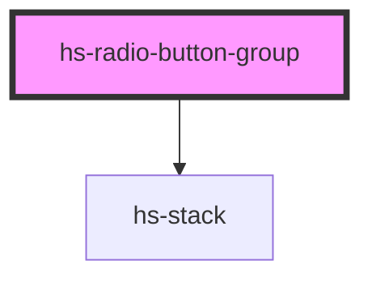

# hs-radio-button-group

<!-- Auto Generated Below -->

## Properties

| Property | Attribute | Description | Type  | Default     |
| -------- | --------- | ----------- | ----- | ----------- |
| `name`   | `name`    |             | `any` | `undefined` |

## Events

| Event         | Description | Type               |
| ------------- | ----------- | ------------------ |
| `valueChange` |             | `CustomEvent<any>` |

## Dependencies

### Depends on

- [hs-stack](../hs-stack)

### Graph

----------------------------------------------

*Built with [StencilJS](https://stenciljs.com/)*
